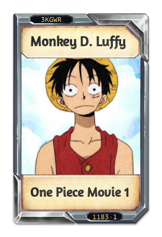
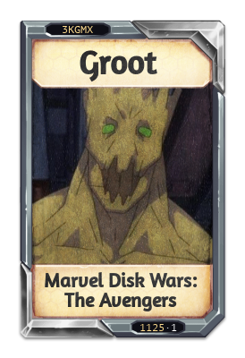
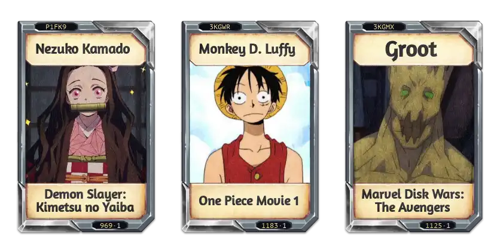

# Karuta Drop Generation

## Introduction

Karuta is a Discord bot that allows users to collect and trade cards. There are multiple ways to
obtain cards one of which is by using the `drop` command which generates an image with some random
cards for the user to choose. The image is in the jpeg format to reduce file size therefore
transparency is not supported so the discord dark theme color is used as background to make it look
like the image is transparent but the jpeg lossy compression creates weird artifacts around the corners
of the cards making it look bad.

## Objective

This project's objective is to explore alternatives to the jpeg format to add trasparency without
increasing file size, this can be achived using WebP.

## Research

I got 3 cards using the `view` command in Karuta and created the drop image with those to check file
sizes.

| Card 1 | Card 2 | Card 3 |
| --- | --- | --- |
| 157263 B | 147534 B | 153572 B |
|  |  |  |

The sum of the sizes of the 3 images is 458369 B, a random drop from the bot was 51373 B, the
following are images creates with different quality options within WebP

| Lossless |
| --- |
| 287540 B |
|  |

| Quality 80 |
| --- |
| 46990 B |
|  |

| Quality 50 |
| --- |
| 29668 B |
|  |